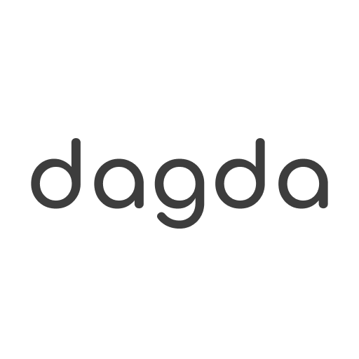

# dagda - Social Network

**Dagda - Social Network** was born from the idea of [@d4viddf](https://github.com/D4vidDf) to create a social network where each user has control of the content they want to see and what content they want to publish.

The concept of the social network should be governed by the users themselves and not by algorithms that control the users feed. Dagda gives users full control by allowing them to filter content by category and dividing their profile into different public or private feeds.

## Join dagda - Social Network

Currently **dagda** is in an early stage of development. For now you can access the preliminary version at https://dagda.social where you can obtain information on the output of the social network.

Soon it will be available in Google Play Store and Apple Store.

## Privacy Policy

Our privacy policy is available on [Privacy Policy](https://dagda.social/privacy-policy)
